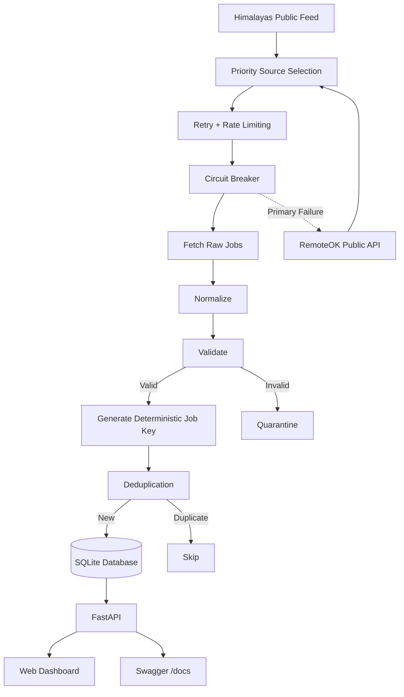

# Resilient Job Ingestion Service

A resilient, multi-source job ingestion service built with **Python, FastAPI, SQLAlchemy, Pydantic, and SQLite**.

The service fetches jobs from permitted public job feeds, normalizes different source formats into a common schema, validates records, prevents duplicates, handles source failures with retry and fallback mechanisms, protects unhealthy sources using a circuit breaker, and quarantines malformed records without stopping the complete ingestion run.

---

## 🌐 Live Demo

**Live Application:**
https://job-ingestion.onrender.com/

**Interactive API Documentation:**
https://job-ingestion.onrender.com/docs

---

## ✨ Features

- Multi-source job ingestion
- Priority-based source fallback
- Retry handling for transient failures
- Rate limiting
- Circuit breaker
- Empty-response handling
- Source-specific normalization
- Pydantic-based validation
- Invalid-record quarantine
- Deterministic SHA-256 deduplication
- Idempotent ingestion
- Ingestion run tracking
- FastAPI REST API
- Lightweight web dashboard
- Automated test suite
- Render deployment

---

## 🏗️ Architecture



---

## 🔀 Source Failure Handling

External sources can fail for several reasons:

- Network error
- Connection failure
- Timeout
- HTTP / request exception
- Unexpected source exception

A failed source can cause the engine to attempt the next source.

```
Source Failure
      ↓
Try Fallback
```

### Empty Response

A source may successfully return zero jobs:

```
[]
```

This is **not** automatically treated as a source outage.

```
Valid Empty Response
      ↓
Do not classify as request failure
```

This distinction avoids unnecessary fallback requests and misleading failure signals.

---

## 🔁 Retry

External services can experience temporary failures. The retry mechanism allows transient failures to recover before the source is abandoned.

```
Attempt 1
   ↓
Failure
   ↓
Retry
   ↓
Attempt 2
   ↓
Failure
   ↓
Retry
   ↓
Attempt 3
   ↓
Success
```

Retry behavior is covered by automated tests.

---

## ⏱️ Rate Limiting & Circuit Breaker

```
Failure
   ↓
Circuit Opens
   ↓
Source Temporarily Skipped
   ↓
Fallback Source
```

---

## ✅ Validation

Validation checks include:

- Required fields exist
- `external_id` is a string
- `title` is a string
- `url` is valid
- `source` is a string
- Required identifiers are not empty

Pydantic is used for schema-level validation. Invalid records are not inserted into the main `jobs` table.

---

## 🗃️ Quarantine

Malformed records should not cause the complete ingestion run to fail. Instead:

```
Raw Job
   ↓
Normalize
   ↓
Validate
   ↓
Invalid
   ↓
Quarantine
```

The quarantine mechanism preserves the invalid payload along with the associated validation errors. This allows valid records from the same ingestion run to continue processing.

---

## ♻️ Deduplication

Repeated ingestion runs should not create duplicate jobs. A deterministic job key is generated using:

```
source + external_id
```

The combined value is hashed using SHA-256:

```
source + external_id
        ↓
      SHA-256
        ↓
      job_key
```

The `job_key` is unique in the database.

**First ingestion**
```
Job
  ↓
New job_key
  ↓
INSERT
```

**Repeated ingestion**
```
Same Job
  ↓
Same job_key
  ↓
Already exists
  ↓
SKIP
```

This makes ingestion idempotent.

---

## 📊 Ingestion Run Tracking

Every ingestion run is tracked so past runs can be inspected via the API (see `GET /runs` below).

---

## 🌐 API

### Health Check
```
GET /health
```
Returns the current service health.

### List Jobs
```
GET /jobs?limit=10
```
Returns recently stored jobs.

### Trigger Ingestion
```
POST /ingest
```
Triggers a new ingestion run.

Example response:
```json
{
  "status": "SUCCESS",
  "source": "himalayas",
  "fetched": 100,
  "inserted": 21,
  "skipped": 79
}
```

### Ingestion Runs
```
GET /runs
```
Returns previous ingestion run information.

### Swagger Documentation

FastAPI provides interactive API documentation at:
```
/docs
```

Live: https://job-ingestion.onrender.com/docs

---

## 🖥️ Web Interface

Observability dashboards.

These improvements are intentionally outside the current scope so that the project remains lightweight, testable, and deployable while demonstrating the core resilient ingestion architecture.

---

## 🎯 Engineering Principles

**Fail Gracefully**
A single external source failure should not bring down the entire ingestion pipeline.

**Validate Before Persistence**
Only normalized and validated records should enter the main `jobs` table.

**Quarantine Bad Data**
Malformed records should be preserved separately instead of silently discarded or crashing the pipeline.

**Avoid Unnecessary Requests**
Rate limiting and circuit breaking prevent repeatedly hitting unhealthy sources.

**Make Ingestion Idempotent**
Repeated ingestion of the same job should not create duplicate database records.

**Separate Source and Processing Logic**
Sources are responsible for fetching source-specific data while the ingestion engine handles normalization, validation, deduplication, and persistence.

**Keep the System Extensible**
Additional permitted sources can be added through the common source interface without rewriting the core pipeline.

---

## 🏁 Final Outcome

This project demonstrates a resilient ingestion pipeline rather than a simple fetch-and-store script.

Instead of:

```
Fetch → Insert
```

the system follows:

```
              External Job Source
                       │
                       ▼
               Source Selection
                       │
                       ▼
               Retry + Rate Limit
                       │
                       ▼
                Circuit Breaker
                       │
                       ▼
                     Fetch
                       │
                       ▼
                   Normalize
                       │
                       ▼
                    Validate
                       │
                 ┌─────┴─────┐
                 │           │
               Valid       Invalid
                 │           │
                 ▼           ▼
            Deduplicate  Quarantine
                 │
                 ▼
               SQLite
                 │
                 ▼
               FastAPI
                 │
            ┌────┴────┐
            ▼         ▼
        Frontend    Swagger
```
